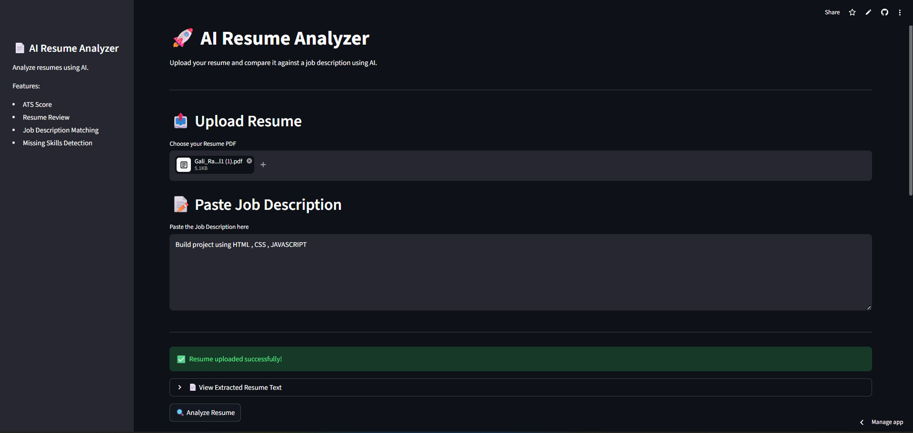
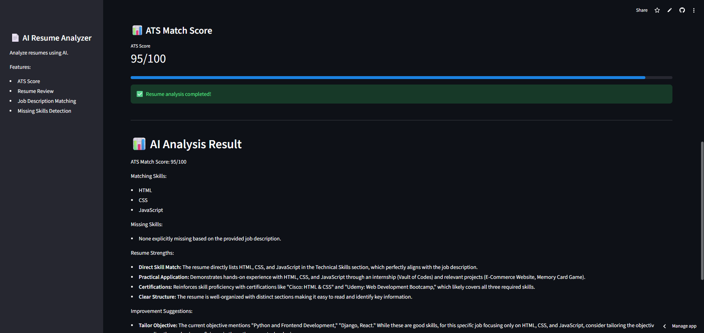

# 🚀 AI Resume Analyzer

An AI-powered Resume Analyzer built using Python, Streamlit, and Google Gemini AI.

This application allows users to:
- Upload resumes in PDF format
- Analyze resumes using AI
- Generate ATS match scores
- Compare resumes with job descriptions
- Identify missing skills and improvement areas

---

# 🔥 Features

✅ Resume PDF Upload  
✅ AI Resume Analysis  
✅ ATS Score Generation  
✅ Job Description Matching  
✅ Missing Skills Detection  
✅ Clean Streamlit UI  

---

# 🛠 Technologies Used

- Python
- Streamlit
- Google Gemini API
- PyMuPDF
- Git & GitHub

---

# 📷 Screenshots

## 🏠 Home Page



---

## 📊 AI Analysis Result




---

# 🌐 Live Demo

🔗 Live App:  
https://ai-resume-analyzer-m9kbrq6z8ya4362jmtnvoa.streamlit.app/

---

# ⚙️ Installation

Clone the repository:

```bash
git clone https://github.com/RamaLokeshSai/ai-resume-analyzer.git